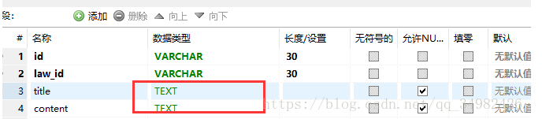
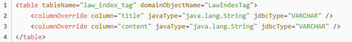

# 使用MyBatis插件过程中遇到的问题

* [现象](#现象)
* [解决过程](#解决过程)

# 现象
在要生成的实体类和数据库表名对应好，执行插件生成相对应的实体类和Mapper层时，发现generator会生成WithBLOBS.java文件并继承entity。

原因：是当表中有Text类型的字段时，generator会生成WithBLOBS.java文件并继承entity，同时具有带有text等类型字段的属性。

# 解决过程
例：

想要将这两个属性合并到entity中需要在xml添加如下配置即可，这样就不会生成WithBLOBS.java文件了

<table tableName="law_index_tag" domainObjectName="LawIndexTag">   
<columnOverride column="title" javaType="java.lang.String" jdbcType="VARCHAR" />   
<columnOverride column="content" javaType="java.lang.String" jdbcType="VARCHAR" /> 
</table>

