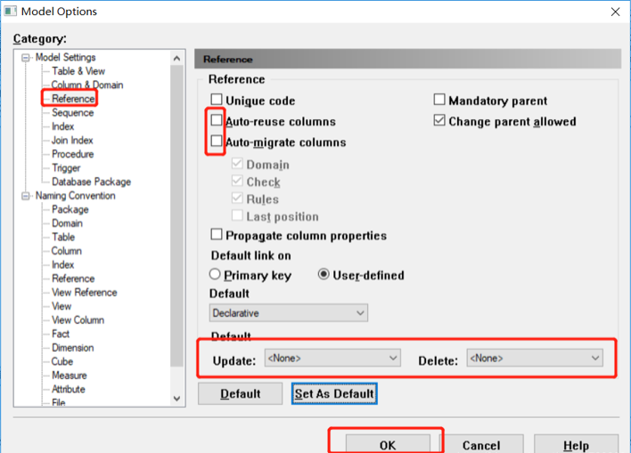
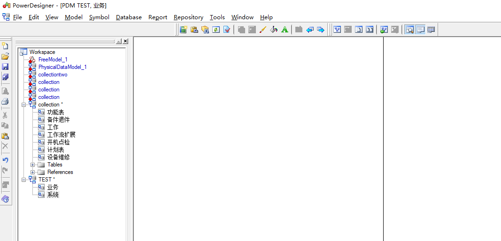
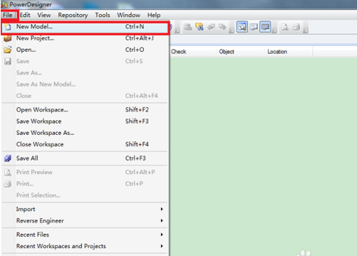
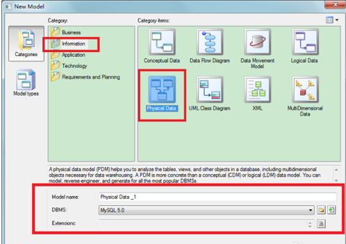
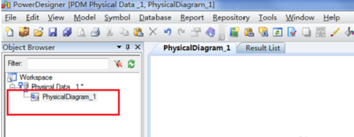
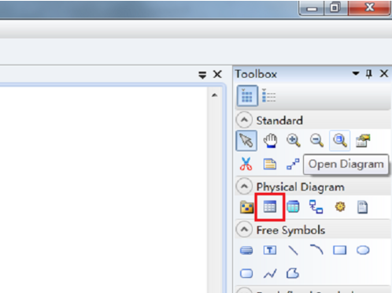
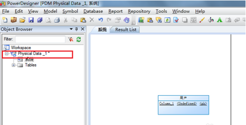
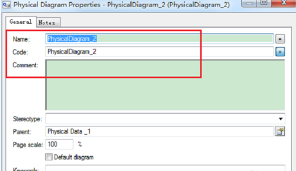
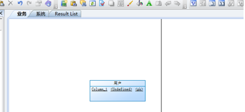

# Table of Contents

* [操作步骤](#操作步骤)
  * [Powerdesigner 常用配置](#powerdesigner-常用配置)
  * [PowerDesigner 常用配置修改](#powerdesigner-常用配置修改)
  * [PowerDesigner 15设置mysql主键自动增长及基数](#powerdesigner-15设置mysql主键自动增长及基数)
  * [PowerDesigner 生成sql没有注释](#powerdesigner-生成sql没有注释)
  * [怎么使用Powerdesigner 自动布局](#怎么使用powerdesigner-自动布局)
  * [Power designer设置线条线为直线](#power-designer设置线条线为直线)
  * [PowerDesigner sql文件逆向工程](#powerdesigner-sql文件逆向工程)
  * [PowerDesigner如何设置字符编码？](#powerdesigner如何设置字符编码)
  * [Powerdesigner12.5 设置表字符集和存储引擎](#powerdesigner125-设置表字符集和存储引擎)
  * [PowerDesigner搜索字段 Ctrl+F](#powerdesigner搜索字段-ctrlf)
  * [Powerdesigner常用配置-修改外键设置](#powerdesigner常用配置-修改外键设置)
  * [PowerDesigner怎么在包中引用别的包中的表](#powerdesigner怎么在包中引用别的包中的表)

# 操作步骤
## Powerdesigner 常用配置

   [常用配置](https://blog.csdn.net/kanglong129/article/category/9330712)

## PowerDesigner 常用配置修改

   [常用配置修改](https://www.cnblogs.com/biyusoft/p/3351471.html)

## PowerDesigner 15设置mysql主键自动增长及基数

   [设置mysql主键自动增长及基数](https://blog.csdn.net/iguiyi/article/details/51899126)

## PowerDesigner 生成sql没有注释

   [生成sql没有注释](https://blog.csdn.net/u010734213/article/details/82774862)

## 怎么使用Powerdesigner 自动布局 

   [自动布局](https://zhidao.baidu.com/question/498087929.html)

## Power designer设置线条线为直线

   [设置线条线为直线](https://jingyan.baidu.com/article/2a13832884929b074a134f0e.html)

## PowerDesigner sql文件逆向工程 

   [sql文件逆向工程](https://blog.csdn.net/qq_41720208/article/details/102606185)

## PowerDesigner如何设置字符编码？ 

   [如何设置字符编码](https://jingyan.baidu.com/article/7c6fb428d4c89080642c90aa.html)

## Powerdesigner12.5 设置表字符集和存储引擎 

   [设置表字符集和存储引擎](http://www.360doc.com/content/10/0819/13/15103_47179467.shtml)

## PowerDesigner搜索字段 Ctrl+F

## Powerdesigner常用配置-修改外键设置

  1 取消自动生成外键列
  
  
  
  2 PowerDesigner给两个表添加reference，中间显示外键信息步骤

## PowerDesigner怎么在包中引用别的包中的表

  1 第一步，打开我们电脑中的PowerDesigner软件，进入软件主页面，如下图所示；
  
  
  
  2 第二步，点击最上方File导航标签，选中“New Model...”，进行新建模块的操作，如下图所示；
  
  
  
  3 第三步，在弹框中的选择“Information”，然后点击“Physical Data”，然后在下方“Model name:”和“DBMS:”中分别输入我们想要的名字和数据库类型，点击“ok”，这样我们就成功建立了一个逻辑模型，如下图所示；
  
  
  
  4 第四步，为了更好理解，我们将目前唯一的一个“图解”重命名，即鼠标右击后选中“Rename”或者直接在鼠标选中的情况下按F2，我将其命名为“系统”，如下图所示；
  
  
  
  5 第五步，在右侧的“toolbox”处点击图上的表格，再在画布上点击，实现新建表操作，同时自行加入表格相关属性，如下图所示；
  
  
  
  
  6 第六步，用鼠标右键点击模块名，在弹框中选择“New”>>“Physical Diagram”，进行新的图解创建（即另一个包），如下图所示；

  
  
  7 第七步，在弹框中对新创建的图解（包）命名，我将其命名为“业务”，如下图所示；
  
  
  
  8 第八步，在“系统”图解页面选中“用户”表，进行复制（鼠标右键点击后点击“Edit”>>“Copy”或者用“Ctrl+c”），然后在“业务”图解页面点击右键，选择“Edit”>>“Paste as Shortcut”，这样就完成了在包里对另一个包里的表进行引用，这样随便编辑哪个表，另一个表会跟着改变，结果如下图所示。

  

  

