# Table of Contents

* [多人开发步骤](#多人开发步骤)
  * [Pd开发规范](#pd开发规范)
* [操作步骤](#操作步骤)
  * [普通表的命名规范](#普通表的命名规范)
  * [外键](#外键)
* [功能表](#功能表)

# 多人开发步骤

## Pd开发规范
- 修改Pd表结构设计时首先需要对Pd进行更新操作
- 修改前在微信群通知 需要修改某某某表结构设计 
- 完成后及时进行提交 并及时在微信群内进行通知

# 操作步骤
- pd建表

  具体操作如下图
  
  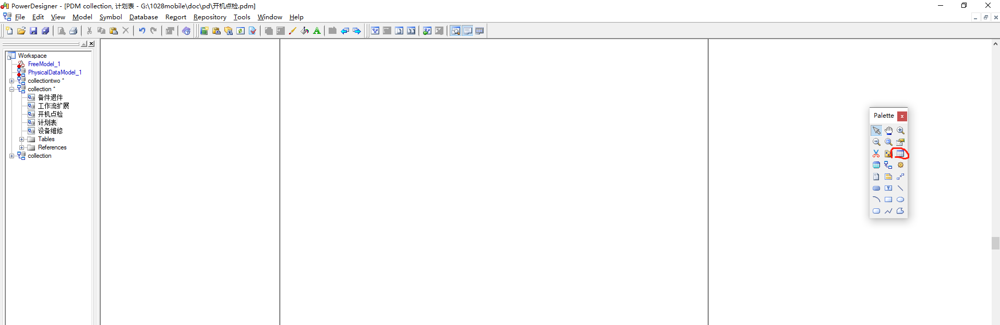
  
  效果如下图
  
  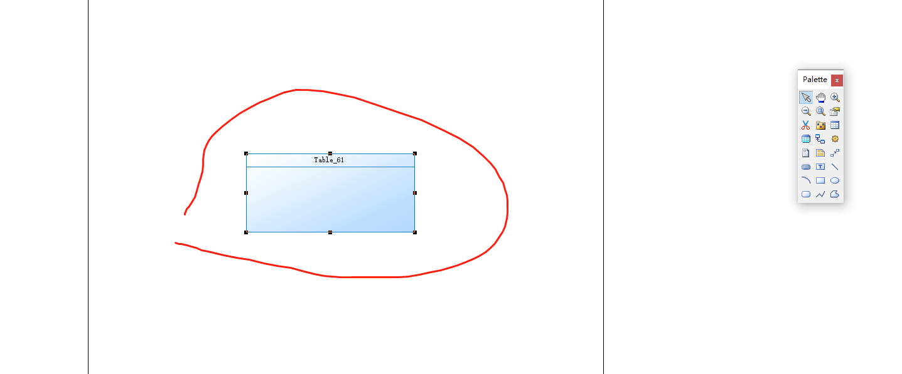
  
  鼠标双击表格，效果如图
  
  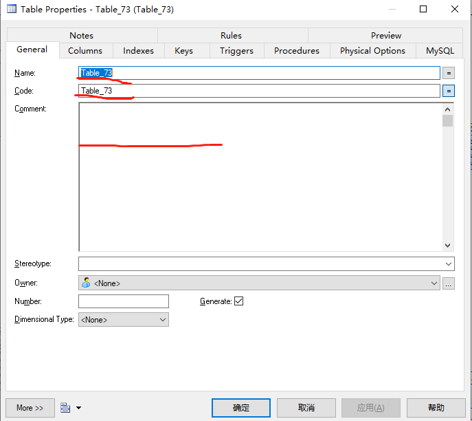
  
  对应的三个红线标处分别为 Name：表名称+表名称注释， Code：表名称，Comment：表描述
  
  完成之后点击Columns，如图
  
  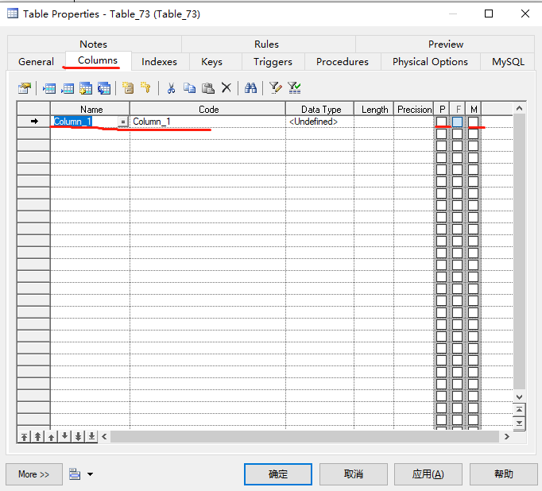
  
  最后点击Name，添加表需要字段即可，P代表主键，M代表不能为空
- 提交git
  
  第一步，鼠标右击开机检点
  
  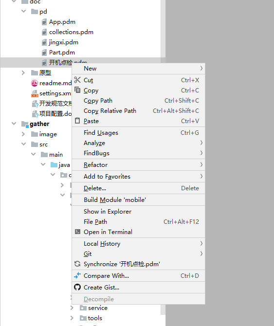
  
  第二步
  
  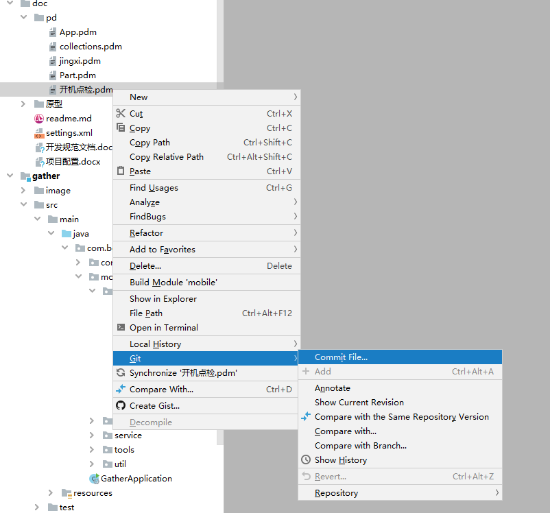
  
  第三步
  
  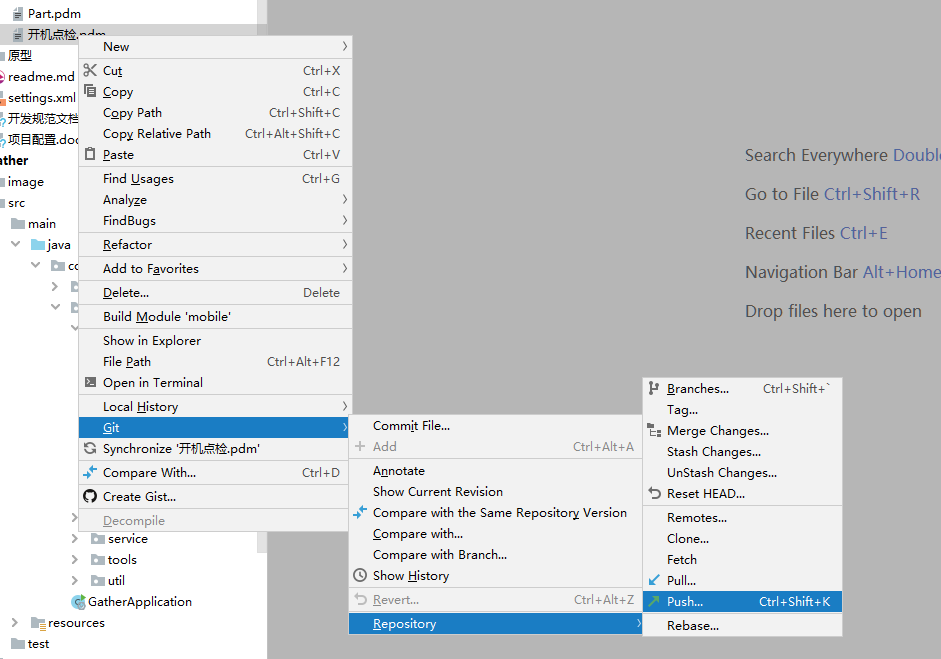
  
- pd导出sql

 第一步：
           
 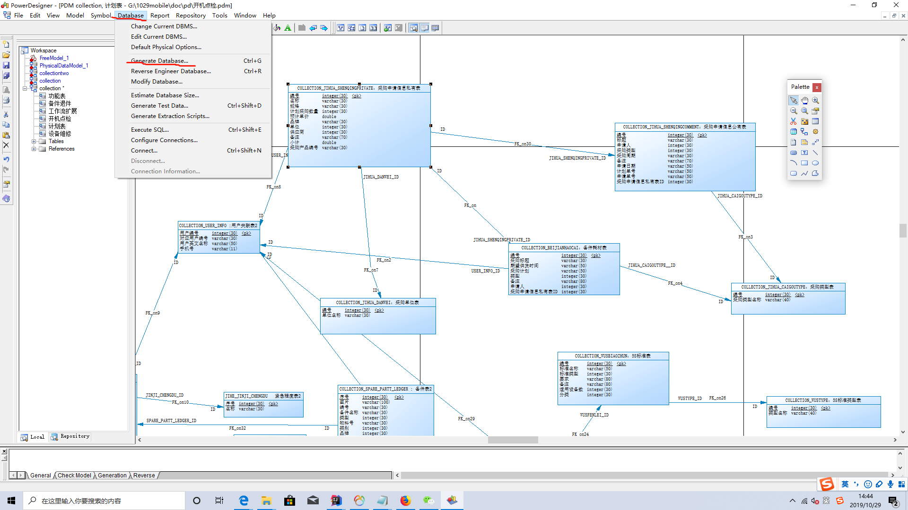
 
 第二步：第一个标红线处，是要存放的位置，第二个标红线位置是该sql文件的名称
 
 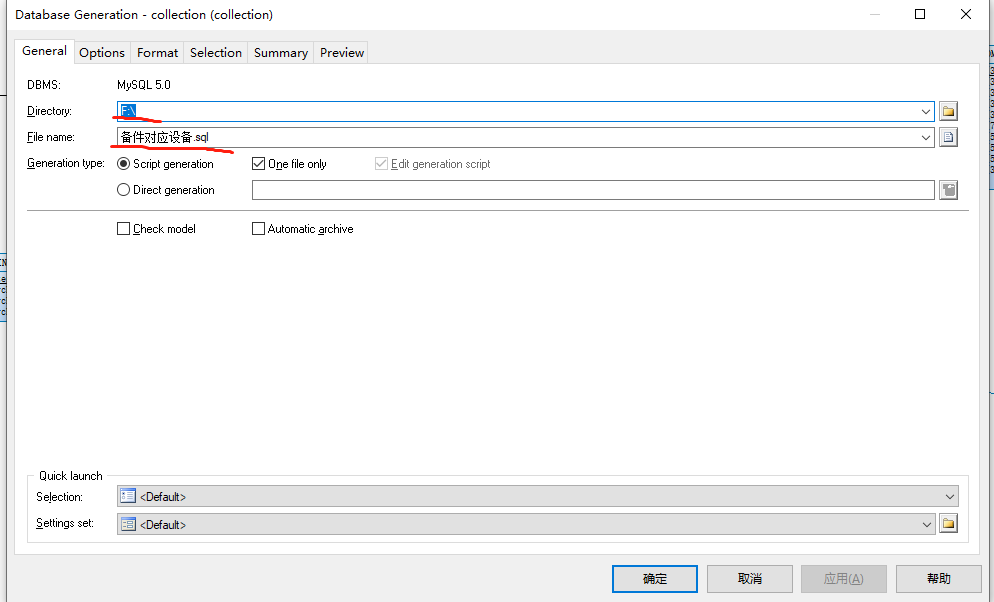
 

- nc执行sql

为防止重复建表时报错，所以，先把pd转为sql文件的形式，然后打开该sql文件，ctrl+f 选择要新建的表相对应的sql

例：

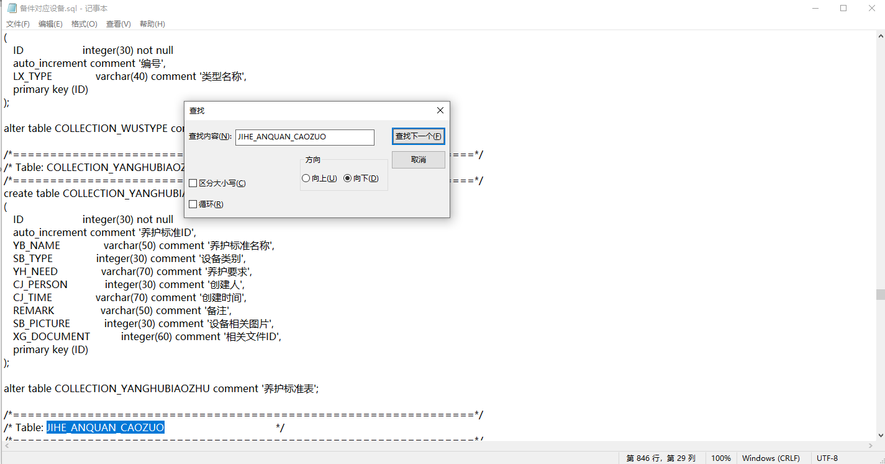

最后将选择的sql粘贴到nc上执行即可

## 普通表的命名规范

例：模块名+表名关键字

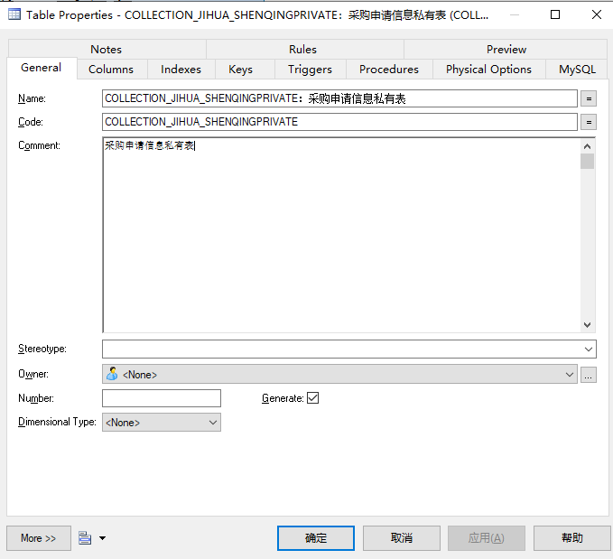

## 
A__B
## 外键
- 表名__关联字段

例：表名后缀+_关联字段

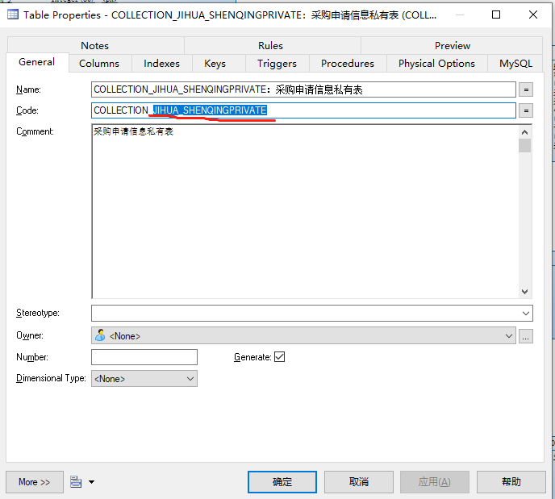

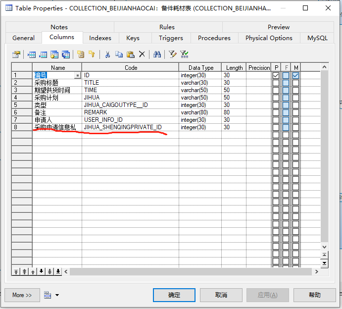

# 功能表
当我们遇到一对多,多对多的需求时，并且表结构已经设计好(PS:设计好的概念是指，程序员已经对该表进行了业务处理（增删改查等sql语句）)，我们不想大批量去动原表的字段，这时我们就需要

一张临时表来作为一对多，多对多表的条件。

例：

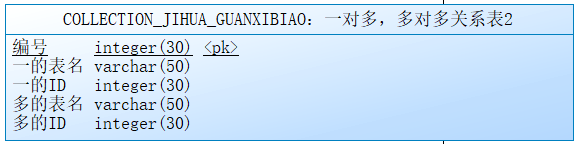

一表的ID作为连接字段，一表的表名作为指定位置，同上多表的ID也是如此
